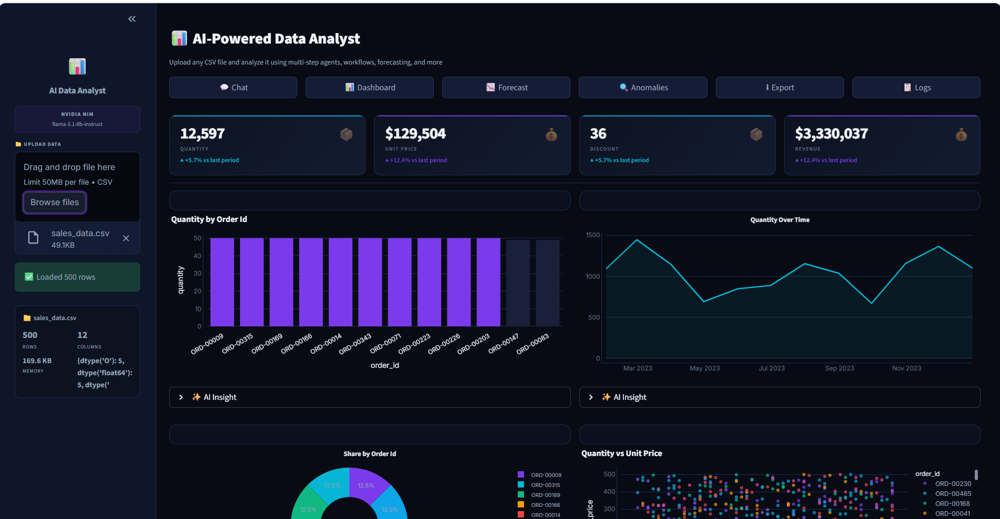
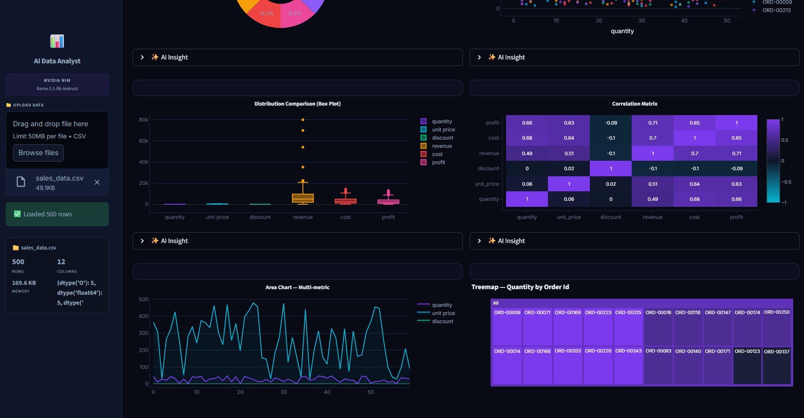
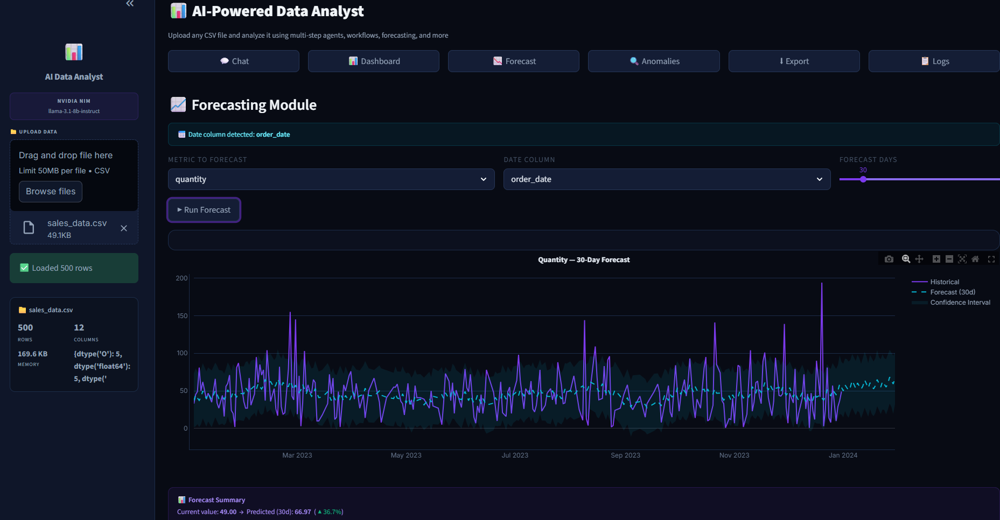
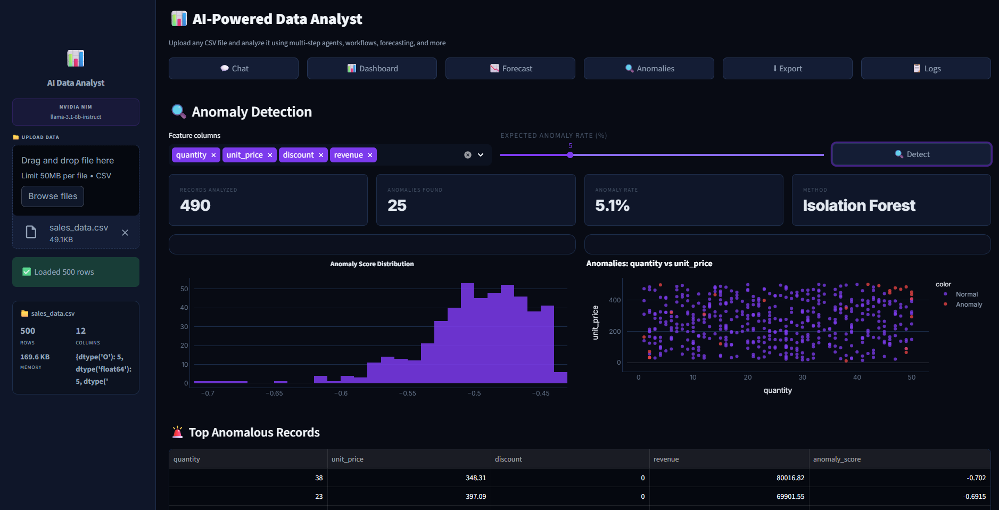
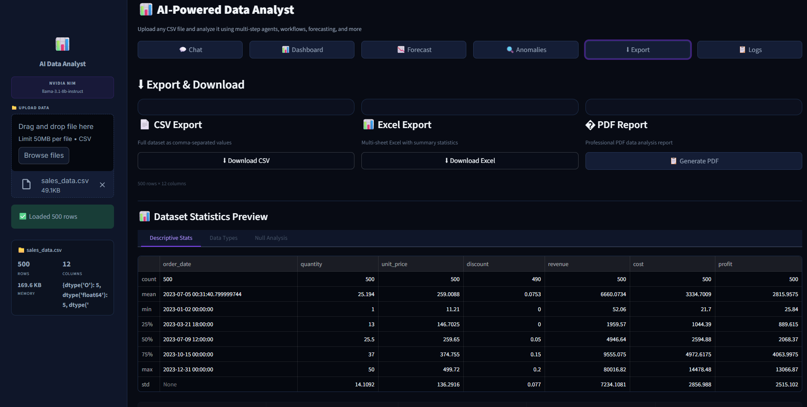
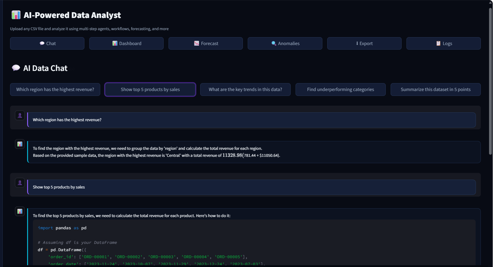

# 📊 AI-Powered Data Analyst

> An AI-powered Data Analyst platform built with **LangGraph + NVIDIA NIM + Streamlit**. Upload any CSV and get instant AI-driven insights, forecasting, anomaly detection, SQL generation, Pandas code, and beautiful interactive visualizations — all in a premium dark glassmorphism dashboard.

---

## 🎥 Demo

> **Live Demo / Video:** https://drive.google.com/file/d/1o2hMFBRfEXq1BE6ceLdT9PVQmDQ5yWn4/view?usp=sharing

---

## 📸 Screenshots








---

## 🏗 Architecture

```
┌─────────────────────────────────────────────────────────────────┐
│                     Streamlit Frontend (app.py)                  │
│   Sidebar │ Dashboard │ AI Chat │ Forecast │ Anomaly │ Export    │
└──────────────────────────┬──────────────────────────────────────┘
                           │ calls
                           ▼
┌─────────────────────────────────────────────────────────────────┐
│               LangGraph Agent Workflow                           │
│                                                                  │
│  planner_node → executor_node → synthesizer_node → memory_node  │
└──────┬─────────────────────────────────────────────────────────┘
       │ tool dispatch
       ▼
┌─────────────────────────────────────────────────────────────────┐
│                        Tools Layer (13 tools)                    │
│                                                                  │
│  csv_loader │ data_validator │ data_profiler │ schema_merger     │
│  query_engine │ sql_generator │ pandas_generator │ visualizer    │
│  anomaly_detector │ insight_generator │ reasoning_engine         │
│  memory_tool │ report_generator                                  │
└──────┬──────────────────────────────────────────────────────────┘
       │
       ▼
┌─────────────────────────────────────────────────────────────────┐
│                       Services Layer                             │
│                                                                  │
│   LLMService (NVIDIA NIM)  │  ExecutionService (AST sandbox)    │
│   SessionService (Streamlit state)                               │
└─────────────────────────────────────────────────────────────────┘
       │
       ▼
┌─────────────────────────────────────────────────────────────────┐
│   NVIDIA NIM REST API  │  SQLite (in-memory)  │  Plotly          │
│   Isolation Forest     │  Prophet / EMA       │  Pandas / NumPy  │
└─────────────────────────────────────────────────────────────────┘
```

### Key Design Decisions

| Decision | Reasoning |
|----------|-----------|
| **NVIDIA NIM over Gemini** | Free tier, OpenAI-compatible REST API, `meta/llama-3.1-8b-instruct` responds in ~3s |
| **LangGraph orchestration** | Deterministic tool routing — planner classifies intent, executor dispatches tools, synthesizer generates answer. Not a single-prompt hack. |
| **AST-based code execution** | Never uses `eval()` or `exec()` on raw strings. Every generated Pandas/SQL snippet is AST-validated against a whitelist before execution. |
| **Streamlit for UI** | Rapid iteration, built-in session state, native Plotly support — ideal for a data analytics demo |
| **SQLite in-memory** | Zero-config SQL execution per session. No persistent storage needed. |
| **No RAG/vector DB** | Structured tabular data is better served by deterministic Pandas/SQL execution than semantic search |

---

## ✨ Features

| Feature | Description |
|---------|-------------|
| 📊 **Auto Dashboard** | Bar, line, pie, scatter, heatmap, box plot, treemap, area chart — all auto-generated from your CSV |
| 💬 **AI Chat** | Ask questions in plain English — NVIDIA NIM answers with specific numbers from your data |
| 📈 **Forecasting** | Prophet-based time series predictions with confidence intervals (EMA fallback if Prophet unavailable) |
| 🔍 **Anomaly Detection** | Isolation Forest identifies outliers, scores them, and explains why each record is anomalous |
| 🛡 **Secure Code Execution** | Generated SQL and Pandas code validated through Python AST before execution — no `eval()` |
| 🗄 **SQL Generation** | Natural language → SQLite SELECT statements with safety validation |
| 🐍 **Pandas Generation** | Natural language → executable Pandas code with step-by-step explanation |
| 💡 **Business Insights** | Statistical Pareto analysis + LLM-powered interpretation |
| 📋 **Observability Logs** | Query count, latency tracking, error monitoring, action distribution charts |
| ⬇ **Export** | CSV, Excel (multi-sheet), AI-generated Markdown reports |
| 🔗 **Multi-CSV Join** | Upload multiple CSVs — AI detects common keys and recommends merges |

---

## 🛠 Technology Stack

| Component | Technology |
|-----------|------------|
| Frontend | Streamlit 1.35 |
| LLM | NVIDIA NIM — `meta/llama-3.1-8b-instruct` |
| Orchestration | LangGraph 0.1 |
| Data Processing | Pandas 2.2, NumPy 1.26 |
| SQL Engine | SQLite (built-in) |
| Visualization | Plotly 5.22 |
| Anomaly Detection | scikit-learn IsolationForest + SciPy Z-score |
| Forecasting | Prophet / Exponential Moving Average fallback |
| Code Security | Python AST validation (whitelist approach) |
| Schema Validation | Pandera 0.19 |
| Configuration | Pydantic Settings 2.3 |
| Logging | Loguru 0.7 |
| PDF/Excel Reports | ReportLab 4.2, openpyxl |
| Testing | Pytest 8.2 (35 tests) |
| Containerization | Docker + docker-compose |

---

## 📁 Folder Structure

```
ai-data-analyst/
│
├── app.py                        ← Streamlit entry point (all pages)
├── .env                          ← Environment variables (API keys)
├── .env.example                  ← Template for .env
├── requirements.txt
├── Dockerfile
├── docker-compose.yml
│
├── config/
│   └── settings.py               ← Pydantic Settings
│
├── agent/                        ← LangGraph workflow
│   ├── graph/
│   │   ├── state.py              ← AgentState TypedDict
│   │   └── builder.py            ← Graph construction + run_agent()
│   ├── nodes/
│   │   ├── planner.py            ← Intent classification
│   │   ├── executor.py           ← Tool dispatch
│   │   ├── synthesizer.py        ← Response synthesis
│   │   └── memory_node.py        ← History persistence
│   └── prompts/
│
├── tools/                        ← 13 analytical tools
│   ├── csv_loader.py
│   ├── data_validator.py
│   ├── data_profiler.py
│   ├── schema_merger.py
│   ├── query_engine.py
│   ├── sql_generator.py
│   ├── pandas_generator.py
│   ├── visualizer.py
│   ├── anomaly_detector.py
│   ├── insight_generator.py
│   ├── reasoning_engine.py
│   ├── memory_tool.py
│   └── report_generator.py
│
├── services/
│   ├── llm_service.py            ← NVIDIA NIM client (direct httpx)
│   ├── execution_service.py      ← Secure AST-based code runner
│   └── session_service.py        ← Streamlit session management
│
├── models/
│   ├── analysis_models.py
│   ├── chart_models.py
│   └── session_models.py
│
├── ui/
│   └── styles/
│       ├── premium.css           ← Glassmorphism dark theme
│       └── custom.css            ← Component overrides
│
├── tests/                        ← 35 Pytest tests
│   ├── conftest.py
│   ├── test_csv_loader.py
│   ├── test_data_validator.py
│   ├── test_data_profiler.py
│   ├── test_execution_service.py
│   ├── test_anomaly_detector.py
│   └── test_schema_merger.py
│
├── data/
│   └── samples/
│       ├── sales_data.csv        ← 500 rows, 12 columns
│       ├── customer_data.csv     ← 50 rows, 11 columns
│       └── product_data.csv      ← 10 rows, 11 columns
│
└── docs/
    └── screenshots/              ← Add your screenshots here
```

---

## ⚙ Installation & Setup

### Prerequisites

- Python 3.11+
- A free **NVIDIA NIM API key** — get one at [build.nvidia.com](https://build.nvidia.com)

### Local Setup

```bash
# 1. Clone the repository
git clone https://github.com/your-username/ai-data-analyst.git
cd ai-data-analyst

# 2. Create and activate virtual environment
python -m venv venv

# Windows
venv\Scripts\activate

# macOS/Linux
source venv/bin/activate

# 3. Install dependencies
pip install -r requirements.txt

# 4. Configure environment
cp .env.example .env
# Open .env and set your NVIDIA_API_KEY

# 5. Generate sample datasets
python data/samples/generate_samples.py

# 6. Run the application
streamlit run app.py
```

Open **http://localhost:8501** in your browser.

---

## 🔑 Environment Configuration

Copy `.env.example` to `.env` and fill in your values:

```env
# LLM Provider
LLM_PROVIDER=nvidia

# NVIDIA NIM — free at https://build.nvidia.com
NVIDIA_API_KEY=nvapi-xxxxxxxxxxxxxxxxxxxxxxxx
NVIDIA_MODEL=meta/llama-3.1-8b-instruct

# App settings
APP_TITLE=AI Data Analyst
APP_VERSION=1.0.0
MAX_FILE_SIZE_MB=50
```

### Available NVIDIA Models (free tier)

| Model | Speed | Best For |
|-------|-------|----------|
| `meta/llama-3.1-8b-instruct` | ~3s ✅ | General analytics, SQL, code |
| `meta/llama-3.3-70b-instruct` | ~30s | Complex reasoning (slower) |
| `meta/llama-3.1-70b-instruct` | ~20s | Detailed insights |

---

## 🐳 Docker Support

### Quick Start with Docker Compose

```bash
# Build and run
docker-compose up --build

# Run in background
docker-compose up -d --build

# Stop
docker-compose down
```

### Build and run with Docker directly

```bash
docker build -t ai-data-analyst .
docker run -p 8501:8501 --env-file .env ai-data-analyst
```

The app will be available at **http://localhost:8501**

---

## 🧪 Running Tests

```bash
# Run all 35 tests
pytest tests/ -v

# Run with coverage report
pytest tests/ -v --cov=. --cov-report=html

# Run a specific module
pytest tests/test_execution_service.py -v
```

**Test coverage:**
- CSV loading and column sanitization
- Data validation and quality scoring
- Dataset profiling and correlation analysis
- Secure AST code execution (import/eval/exec blocking)
- Anomaly detection with known outlier injection
- Multi-CSV schema merger and join key detection

---

## 📊 Sample Datasets

Three realistic sample datasets are included in `data/samples/`:

| File | Rows | Columns | Description |
|------|------|---------|-------------|
| `sales_data.csv` | 500 | 12 | Orders with revenue, product, region, date, profit — includes injected anomalies |
| `customer_data.csv` | 50 | 11 | Customer segments, ACV, satisfaction scores, churn risk |
| `product_data.csv` | 10 | 11 | Product catalog with pricing, inventory, ratings |

**Try these sample questions after uploading `sales_data.csv`:**
```
Which region has the highest total revenue?
Show monthly revenue trend as a line chart
Who are the top 10 customers by revenue?
Detect anomalies in this dataset
Generate business insights
What is the average discount by sales rep?
```

**Test the multi-CSV join feature:** Upload `sales_data.csv` + `customer_data.csv` — the AI will detect the shared `customer_id` column and suggest a merge.

---

## 🔒 Security Architecture

Generated code is **never executed directly**. The execution pipeline:

1. Parse code into an AST with `ast.parse()`
2. Walk every node through `ASTValidator` — each node type checked against a whitelist
3. Forbidden: `Import`, `ImportFrom`, `__builtins__`, `os`, `sys`, `subprocess`, `open`, `eval`, `exec`
4. Only if validation passes: execute via `exec(compile(...))` in a restricted namespace with only `pd`, `np`, the DataFrame, and safe built-ins

SQL queries are validated to be `SELECT`-only before execution in an in-memory SQLite database.

---

## 🚀 Deployment

### Streamlit Community Cloud (Free)

1. Push repo to GitHub
2. Go to [share.streamlit.io](https://share.streamlit.io)
3. Connect your repo, set `app.py` as entry point
4. Add `NVIDIA_API_KEY` in the secrets manager

### Render / Railway

```bash
# Procfile
web: streamlit run app.py --server.port=$PORT --server.address=0.0.0.0
```

---

## 📝 Implementation Notes

- **No RAG/vector databases** — structured tabular analytics works better with deterministic Pandas/SQL execution than semantic search. The LLM acts as a planner, not a retriever.
- **Session state** — all data lives in `st.session_state`. Clearing session or restarting the app resets everything. For production, replace with Redis.
- **Anomaly detection** samples up to 10,000 rows for performance. Configure `MAX_ANOMALY_SAMPLES` in `.env`.
- **Forecasting** uses Prophet if installed, otherwise falls back to Exponential Moving Average — the app never crashes due to a missing optional dependency.
- **Multi-CSV merge** supports two datasets at a time. Sequential merges create chained joined datasets.

---

## 🔮 Future Improvements

- [ ] Streaming responses (token-by-token display in chat)
- [ ] PowerPoint/slides export
- [ ] Support for Excel (.xlsx) uploads
- [ ] Multi-user authentication with OAuth
- [ ] PostgreSQL for persistent sessions across restarts
- [ ] Scheduled data refresh for live data sources
- [ ] REST API endpoint alongside the Streamlit UI
- [ ] Fine-tuned model for SQL/Pandas generation
- [ ] Natural language to Plotly chart spec generation

---

## 👩‍💻 Author

Built as part of an AI engineering assessment. The objective was to architect and implement an enterprise-quality AI-powered Data Analyst that demonstrates clean architecture, modularity, security, and explainability.

**Tech choices reflect production engineering standards:**
- Typed Pydantic models across every layer
- Single-responsibility modules (no god files)
- Secure-by-default code execution
- Comprehensive test coverage
- Docker-ready deployment

---


